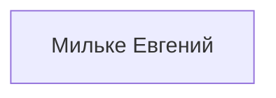
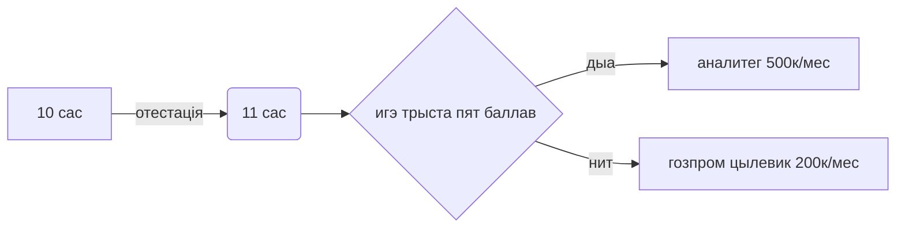
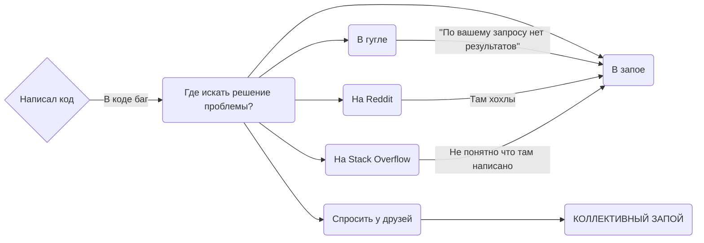
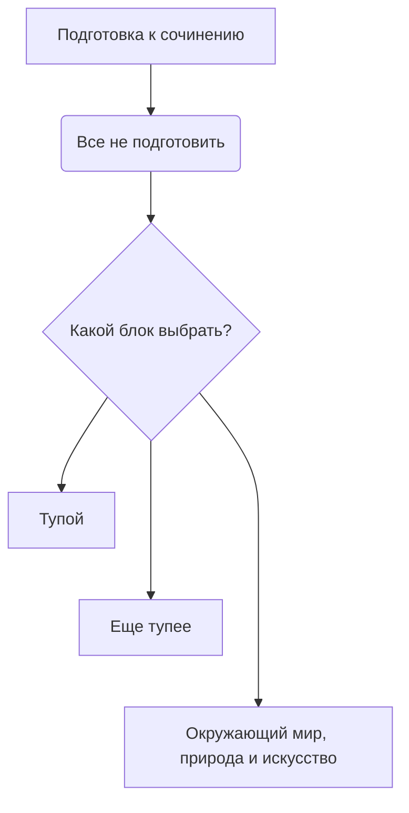

# StirlitzMuller1489.github.io

<a href="https://stirlitzmuller1489.github.io/" class="button_1670312305034" target="_blank">
  САЙТ
</a>

<a href="https://github.com/StirlitzMuller1489/StirlitzMuller1489.github.io/blob/main/README.md" class="button_1670312305034" target="_blank">
  РЕПОЗИТОРИЙ
</a>

  
